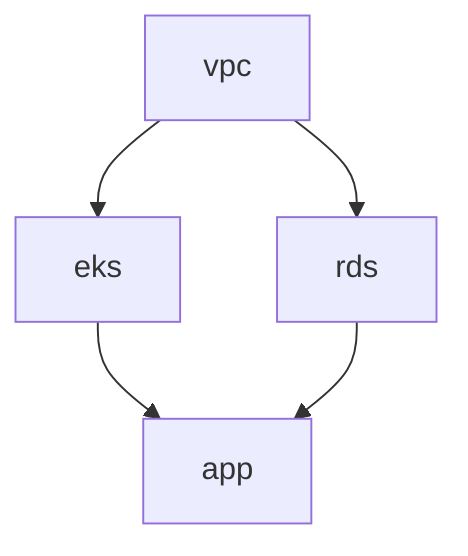
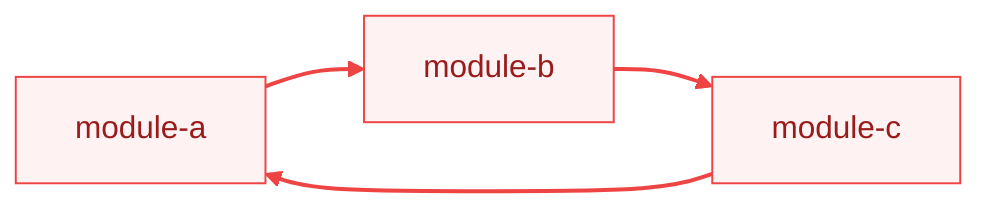

# Dependency Resolution

TerraCi automatically discovers dependencies between Terraform modules by analyzing `terraform_remote_state` data sources.

## How It Works

### 1. Parse Remote State References

TerraCi parses all `.tf` files in each module looking for `terraform_remote_state` data sources:

```hcl
data "terraform_remote_state" "vpc" {
  backend = "s3"
  config = {
    bucket = "my-terraform-state"
    key    = "platform/production/us-east-1/vpc/terraform.tfstate"
    region = "us-east-1"
  }
}
```

### 2. Extract State Paths

From each remote state block, TerraCi extracts:
- **Backend type** (s3, gcs, azurerm, etc.)
- **State file path** (from `key`, `prefix`, or similar)
- **Whether `for_each` is used**

### 3. Match to Modules

The state path is matched against discovered modules. The `key` must mirror the directory structure (matching the configured `structure.pattern`):

```
key: platform/production/us-east-1/vpc/terraform.tfstate
     ↓
Module ID: platform/production/us-east-1/vpc  (= RelativePath)
```

### 4. Build Dependency Graph

Dependencies are added to a directed acyclic graph (DAG):



## Supported Backends

TerraCi extracts state paths from these backends:

| Backend | Path Field |
|---------|------------|
| s3 | `key` |
| gcs | `prefix` |
| azurerm | `key` |
| http | `address` |
| consul | `path` |

## Dynamic References with `for_each`

TerraCi handles `for_each` in remote state blocks:

```hcl
locals {
  dependencies = {
    vpc = "platform/production/us-east-1/vpc"
    iam = "platform/production/us-east-1/iam"
  }
}

data "terraform_remote_state" "deps" {
  for_each = local.dependencies

  backend = "s3"
  config = {
    bucket = "my-terraform-state"
    key    = "${each.value}/terraform.tfstate"
  }
}
```

This creates dependencies on both `vpc` and `iam` modules.

## Static Evaluation

TerraCi is a static analysis tool — it evaluates Terraform expressions without running `terraform init` or connecting to remote backends. It supports a wide range of Terraform built-in functions:

- **String**: `split`, `join`, `format`, `lower`, `upper`, `trimprefix`, `trimsuffix`, `replace`, `substr`, `trim`, `trimspace`, `regex`
- **Collection**: `element`, `length`, `lookup`, `concat`, `contains`, `keys`, `values`, `merge`, `flatten`, `distinct`
- **Type conversion**: `tostring`, `tonumber`, `tobool`, `tolist`, `toset`, `tomap`
- **Numeric**: `max`, `min`, `ceil`, `floor`
- **Filesystem**: `abspath`

### Locals Resolution

Locals are evaluated iteratively (multi-pass) — locals that reference other locals, `path.module`, or functions are resolved across multiple passes until all dependencies are satisfied.

A common monorepo pattern that works out of the box:

```hcl
locals {
  path_arr    = split("/", abspath(path.module))
  service     = local.path_arr[length(local.path_arr) - 4]
  environment = local.path_arr[length(local.path_arr) - 3]
  region      = local.path_arr[length(local.path_arr) - 2]
  module      = local.path_arr[length(local.path_arr) - 1]
}

data "terraform_remote_state" "vpc" {
  backend = "s3"
  config = {
    key = "${local.service}/${local.environment}/${local.region}/vpc/terraform.tfstate"
  }
}
```

Simple string locals also work:

```hcl
locals {
  env       = "production"
  region    = "us-east-1"
  state_key = "platform/${local.env}/${local.region}/vpc/terraform.tfstate"
}
```

### Variables from tfvars

TerraCi loads variable values from multiple sources (in priority order):
1. `default` values in `variable` blocks (any type — string, bool, list, map, object)
2. `terraform.tfvars`
3. `*.auto.tfvars` files (highest priority)

This means complex `for_each` patterns using variables from tfvars are resolved:

```hcl
# terraform.tfvars
managed_environments = [
  { service = "platform", environment = "stage", region = "eu-central-1" },
  { service = "platform", environment = "prod",  region = "eu-central-1" },
]

# main.tf
data "terraform_remote_state" "vpc" {
  for_each = { for v in var.managed_environments : "${v.service}-${v.environment}" => v }
  backend  = "s3"
  config = {
    key = "${lookup(each.value, "service")}/${lookup(each.value, "environment")}/${lookup(each.value, "region")}/vpc/terraform.tfstate"
  }
}
```

### Limitations

::: warning Static Analysis Only
TerraCi does **not** connect to remote backends or execute `terraform init`. It cannot resolve values that only exist at runtime:

- **Remote state outputs**: `data.terraform_remote_state.X.outputs.Y` used as a key in another remote state
- **External data sources**: `data.external`, `data.http`, etc.
- **Provider-dependent values**: resource attributes, data source results

**Recommended approach**: Derive state keys from the filesystem path (`abspath(path.module)`) or explicit locals/variables, not from other modules' outputs.
:::

::: warning Single State Namespace
TerraCi matches dependencies by the `key` path in remote state config only — it **ignores** `bucket`, `backend` type, `region`, and other backend-specific fields. This means:

- If two modules store state in **different buckets** but use the **same key path** (e.g., `platform/prod/eu-central-1/vpc/terraform.tfstate`), TerraCi cannot tell them apart and may create incorrect dependency links
- If you use **different backend types** (e.g., S3 for production, local for dev) with overlapping key paths, the same ambiguity applies

**Recommended approach**: Ensure state key paths are **globally unique** across all buckets and backends. A good convention is to include a distinguishing prefix in the key (e.g., the team or project name):

```hcl
# Team A — bucket: team-a-state
key = "team-a/platform/prod/eu-central-1/vpc/terraform.tfstate"

# Team B — bucket: team-b-state
key = "team-b/platform/prod/eu-central-1/vpc/terraform.tfstate"
```
:::

## Name-Based Fallback

If the state path can't be matched to a module, TerraCi falls back to name-based matching:

```hcl
# Module: platform/production/us-east-1/eks

data "terraform_remote_state" "vpc" {  # ← name "vpc"
  # ...
}
```

TerraCi looks for a module named `vpc` in the same context prefix (i.e., matching all segments except the last one from the configured pattern).

## Submodule Dependencies

For submodules, TerraCi also tries pattern matching:

```hcl
# In module: platform/production/us-east-1/ec2/rabbitmq

data "terraform_remote_state" "ec2_base" {
  # ...
}
```

Matches:
- `ec2_base` → `ec2/base` (submodule pattern)
- `ec2-base` → `ec2/base` (dash-separated)

## Cross-Environment Dependencies

TerraCi supports dependencies that cross environment or region boundaries. This is useful when a module in one environment needs to reference resources from another:

```hcl
# In module: platform/stage/eu-central-1/ec2/db-migrate

# Same environment/region dependency
data "terraform_remote_state" "vpc" {
  backend = "s3"
  config = {
    key = "${local.service}/${local.environment}/${local.region}/vpc/terraform.tfstate"
  }
}

# Cross-environment dependency (hardcoded path)
data "terraform_remote_state" "vpn_vpc" {
  backend = "s3"
  config = {
    key = "${local.service}/vpn/eu-north-1/vpc/terraform.tfstate"
  }
}
```

Both dependencies will be detected:
- `platform/stage/eu-central-1/vpc` (from dynamic path)
- `platform/vpn/eu-north-1/vpc` (from hardcoded cross-env path)

TerraCi resolves `local.*` variables from the module path structure, allowing you to mix dynamic and hardcoded paths in the same module.

See the [cross-env-deps example](https://github.com/edelwud/terraci/tree/main/examples/cross-env-deps) for a complete working example.

## Cycle Detection

TerraCi detects circular dependencies:

```bash
terraci validate
```

Output:


Circular dependencies prevent pipeline generation.

## Visualization

Export the dependency graph to visualize:

```bash
# DOT format for GraphViz
terraci graph --format dot -o deps.dot
dot -Tpng deps.dot -o deps.png

# Simple text format
terraci graph --format list

# Show execution levels
terraci graph --format levels
```

## Execution Levels

TerraCi groups modules into execution levels:

```
Level 0: [vpc, iam]           # No dependencies
Level 1: [eks, rds]           # Depend on level 0
Level 2: [app]                # Depends on level 1
```

Modules at the same level can run in parallel.

## Troubleshooting

### Dependency Not Detected

1. Check that the state path matches a module ID:
   ```bash
   terraci validate -v
   ```

2. Check for typos in the remote state config

### Too Many Dependencies

If unintended dependencies are detected:

1. Review the remote state `key` values
2. Ensure state paths match the expected pattern
3. Check for shared state files being referenced

### Missing Module

If a referenced module isn't discovered:

1. Verify the module exists at the correct depth
2. Check that it contains `.tf` files
3. Ensure it's not excluded by filter patterns

## Next Steps

- [Pipeline Generation](/guide/pipeline-generation) — See how the dependency graph becomes a CI pipeline
- [Graph Visualization](/cli/graph) — Export and visualize the dependency graph
