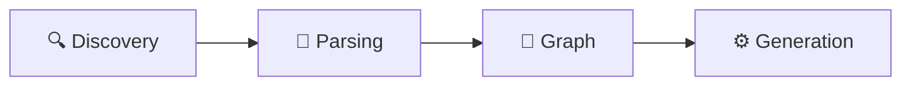
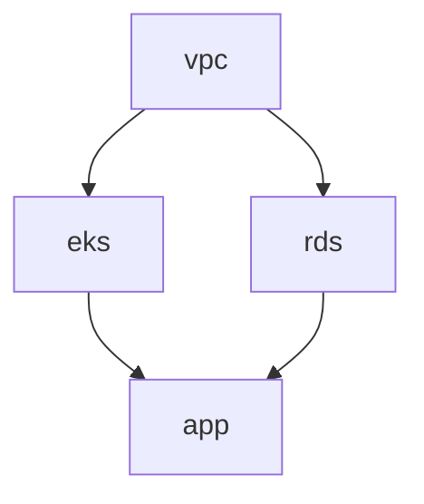
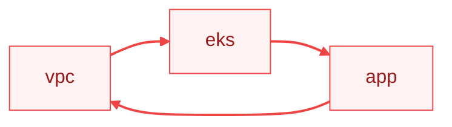
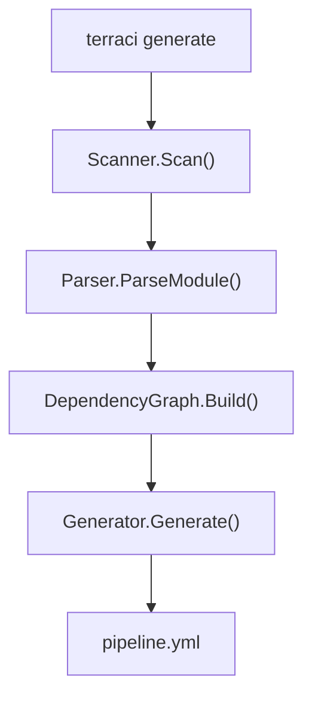

# How It Works

This guide explains TerraCi's internal architecture and data flow.

## Overview

TerraCi processes your Terraform project in four stages:



## Stage 1: Module Discovery

TerraCi scans your directory structure to find Terraform modules.

### How It Works

1. Walk the directory tree starting from project root
2. Look for directories at depth 4-5 containing `.tf` files
3. Parse the path to extract service, environment, region, module

### Example

```
platform/stage/eu-central-1/vpc/main.tf
   │       │         │       │
   │       │         │       └── module: vpc
   │       │         └── region: eu-central-1
   │       └── environment: stage
   └── service: platform
```

### Module ID

Each module gets a unique ID: `platform/stage/eu-central-1/vpc`

This ID is used for:
- Dependency matching
- Job naming
- State file path resolution

## Stage 2: HCL Parsing

TerraCi parses each module's `.tf` files to extract dependencies.

### What Gets Parsed

1. **`terraform_remote_state` blocks** - Primary dependency source
2. **`locals` blocks** - Variable resolution for dynamic paths

### Remote State Example

```hcl
data "terraform_remote_state" "vpc" {
  backend = "s3"
  config = {
    bucket = "my-state"
    key    = "platform/stage/eu-central-1/vpc/terraform.tfstate"
  }
}
```

TerraCi extracts:
- Backend type: `s3`
- State path: `platform/stage/eu-central-1/vpc/terraform.tfstate`
- Resolved module: `platform/stage/eu-central-1/vpc`

### Path Resolution

TerraCi resolves variables in state paths:

```hcl
locals {
  env = "stage"
}

data "terraform_remote_state" "vpc" {
  config = {
    key = "platform/${local.env}/eu-central-1/vpc/terraform.tfstate"
  }
}
```

Becomes: `platform/stage/eu-central-1/vpc/terraform.tfstate`

### for_each Handling

When `for_each` is present, TerraCi expands to multiple dependencies:

```hcl
data "terraform_remote_state" "services" {
  for_each = toset(["auth", "api", "web"])
  config = {
    key = "platform/stage/eu-central-1/${each.key}/terraform.tfstate"
  }
}
```

Creates dependencies on: `auth`, `api`, `web` modules.

## Stage 3: Graph Building

TerraCi builds a Directed Acyclic Graph (DAG) of module dependencies.

### Algorithm

1. Create a node for each discovered module
2. Add edges from each module to its dependencies
3. Detect cycles (error if found)
4. Topologically sort using Kahn's algorithm

### Topological Sort

Kahn's algorithm ensures modules are ordered so dependencies come first:



Output order:
- Level 0: vpc
- Level 1: eks, rds (parallel)
- Level 2: app

### Execution Levels

Modules are grouped into levels for parallel execution:

| Level | Modules | Can Run In Parallel |
|-------|---------|---------------------|
| 0 | vpc | Yes (no deps) |
| 1 | eks, rds | Yes (same deps) |
| 2 | app | After level 1 |

### Cycle Detection

TerraCi detects circular dependencies:



Error message:
```
Error: circular dependency detected
  vpc -> eks -> app -> vpc
```

## Stage 4: Pipeline Generation

TerraCi generates GitLab CI YAML from the sorted module graph.

### Job Generation

For each module, TerraCi generates:

1. **Plan job** (if `plan_enabled: true`)
   - Runs `terraform plan -out=plan.tfplan`
   - Saves plan as artifact

2. **Apply job**
   - Depends on plan job (`needs`)
   - Runs `terraform apply plan.tfplan`
   - Manual trigger (if `auto_approve: false`)

### Stage Mapping

Execution levels map to GitLab stages:

```yaml
stages:
  - deploy-plan-0   # Level 0 plans
  - deploy-apply-0  # Level 0 applies
  - deploy-plan-1   # Level 1 plans
  - deploy-apply-1  # Level 1 applies
```

### Dependency Chain

```yaml
plan-vpc:
  stage: deploy-plan-0

apply-vpc:
  stage: deploy-apply-0
  needs: [plan-vpc]

plan-eks:
  stage: deploy-plan-1
  needs: [apply-vpc]  # Waits for vpc to be applied

apply-eks:
  stage: deploy-apply-1
  needs: [plan-eks]
```

## Data Flow Diagram



Each stage:

| Step | Function | What it does |
|------|----------|-------------|
| 1 | `Scanner.Scan()` | Walk directory tree, find `.tf` files at depth 4-5, create Module structs |
| 2 | `Parser.ParseModule()` | Parse HCL, extract locals, find `terraform_remote_state`, resolve variables |
| 3 | `DependencyGraph.Build()` | Add nodes/edges, detect cycles, topological sort → execution levels |
| 4 | `Generator.Generate()` | Create stages, generate plan/apply jobs, apply overwrites, output YAML |

## Key Types

### Module

Represents a discovered Terraform module:

```go
type Module struct {
    Service      string  // platform
    Environment  string  // stage
    Region       string  // eu-central-1
    Module       string  // vpc
    Path         string  // /abs/path/to/vpc
    RelativePath string  // platform/stage/eu-central-1/vpc
}

func (m *Module) ID() string  // "platform/stage/eu-central-1/vpc"
```

### RemoteStateRef

Represents a `terraform_remote_state` dependency:

```go
type RemoteStateRef struct {
    Name         string            // "vpc"
    Backend      string            // "s3"
    Config       map[string]string // bucket, key, region
    WorkspaceDir string            // resolved module path
}
```

### DependencyGraph

Manages module relationships:

```go
type DependencyGraph struct {
    nodes map[string]*Module
    edges map[string][]string  // from -> [to, to, ...]
}

func (g *DependencyGraph) AddEdge(from, to *Module)
func (g *DependencyGraph) TopologicalSort() ([]*Module, error)
func (g *DependencyGraph) ExecutionLevels() [][]*Module
func (g *DependencyGraph) DetectCycles() [][]string
```

## Performance

TerraCi is designed for speed:

| Project Size | Modules | Parse Time | Generate Time |
|--------------|---------|------------|---------------|
| Small | 10 | ~100ms | ~50ms |
| Medium | 50 | ~300ms | ~100ms |
| Large | 200 | ~1s | ~300ms |

Tips for large projects:
- Use `exclude` patterns to skip irrelevant directories
- Use `--changed-only` for incremental pipelines
- Enable caching in generated pipelines

## See Also

- [Project Structure](/guide/project-structure) - Directory layout requirements
- [Dependencies](/guide/dependencies) - Dependency detection details
- [Pipeline Generation](/guide/pipeline-generation) - Generated output format
