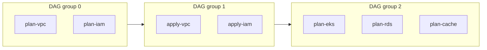

# Pipeline Generation

TerraCi generates CI pipelines that respect module dependencies and enable parallel execution. Both GitLab CI and GitHub Actions are fully supported.

## Basic Generation

Generate a pipeline for all modules:

```bash
# GitLab CI
terraci generate -o .gitlab-ci.yml

# GitHub Actions
terraci generate -o .github/workflows/terraform.yml
```

The provider is selected via `TERRACI_PROVIDER`, auto-detected from the environment (`GITLAB_CI` env var selects GitLab, `GITHUB_ACTIONS` selects GitHub Actions), or inferred from a single active provider.

## GitLab CI Pipeline Structure

The generated GitLab CI pipeline includes:

### Stages

GitLab stages are derived from topological DAG layers:

```yaml
stages:
  - deploy-0
  - deploy-1
  - deploy-2
  - deploy-3
```

### Variables

Global variables are set from configuration:

```yaml
variables:
  TERRAFORM_BINARY: "terraform"
  TF_IN_AUTOMATION: "true"
  TF_INPUT: "false"
```

### Default Configuration

Shared job settings:

```yaml
default:
  image: hashicorp/terraform:1.6
  before_script:
    - ${TERRAFORM_BINARY} init
  tags:
    - terraform
    - docker
```

### Jobs

Two jobs per module (if `plan_enabled: true`):

```yaml
plan-platform-prod-us-east-1-vpc:
  stage: deploy-0
  script:
    - cd platform/prod/us-east-1/vpc
    - ${TERRAFORM_BINARY} plan -out=plan.tfplan
  variables:
    TF_MODULE_PATH: platform/prod/us-east-1/vpc
    TF_SERVICE: platform
    TF_ENVIRONMENT: prod
    TF_REGION: us-east-1
    TF_MODULE: vpc
  artifacts:
    paths:
      - platform/prod/us-east-1/vpc/plan.tfplan
    expire_in: 1 day
  resource_group: platform/prod/us-east-1/vpc

apply-platform-prod-us-east-1-vpc:
  stage: deploy-1
  script:
    - cd platform/prod/us-east-1/vpc
    - ${TERRAFORM_BINARY} apply plan.tfplan
  needs:
    - job: plan-platform-prod-us-east-1-vpc
  when: manual
  resource_group: platform/prod/us-east-1/vpc
```

::: tip Dynamic Environment Variables
The `TF_SERVICE`, `TF_ENVIRONMENT`, `TF_REGION`, `TF_MODULE` variables are generated dynamically from the configured pattern segments. If your pattern is `{team}/{env}/{module}`, the variables would be `TF_TEAM`, `TF_ENV`, and `TF_MODULE` instead.
:::

## Job Dependencies

Jobs use GitLab's `needs` keyword to express dependencies:

```yaml
plan-platform-prod-us-east-1-eks:
  stage: deploy-2
  needs:
    - job: apply-platform-prod-us-east-1-vpc  # Wait for VPC
  # ...

apply-platform-prod-us-east-1-eks:
  stage: deploy-3
  needs:
    - job: plan-platform-prod-us-east-1-eks   # Wait for own plan
    - job: apply-platform-prod-us-east-1-vpc  # Wait for VPC
  # ...
```

## Parallel Execution

Independent DAG jobs in the same topological group can run in parallel:



## GitHub Actions Workflow Structure

When using the GitHub Actions provider, TerraCi generates a workflow file with jobs connected by DAG dependencies:

```yaml
name: Terraform
on:
  pull_request:
  workflow_dispatch:

jobs:
  plan-platform-prod-us-east-1-vpc:
    runs-on: ubuntu-latest
    steps:
      - uses: actions/checkout@v4
      - name: Plan
        run: |
          cd platform/prod/us-east-1/vpc
          terraform plan -out=plan.tfplan
      - uses: actions/upload-artifact@v4
        with:
          name: plan-platform-prod-us-east-1-vpc
          path: platform/prod/us-east-1/vpc/plan.tfplan

  apply-platform-prod-us-east-1-vpc:
    needs: [plan-platform-prod-us-east-1-vpc]
    runs-on: ubuntu-latest
    environment: production
    steps:
      - uses: actions/checkout@v4
      - uses: actions/download-artifact@v4
        with:
          name: plan-platform-prod-us-east-1-vpc
      - name: Apply
        run: |
          cd platform/prod/us-east-1/vpc
          terraform apply plan.tfplan
```

GitHub Actions jobs use `needs` for dependency ordering, `actions/upload-artifact` and `actions/download-artifact` for passing plan files between jobs, and `environment` for approval gates.

## Changed-Only Pipelines

Generate pipelines for changed modules and their related modules:

```bash
terraci generate --changed-only --base-ref main -o .gitlab-ci.yml
```

This:
1. Detects files changed since `main` branch
2. Maps changed files to modules
3. Finds all modules that depend on changed modules (dependents)
4. Finds all modules that changed modules depend on (dependencies)
5. Generates a pipeline only for affected modules

### Example: Root module changes

If `vpc/main.tf` changes:
- `vpc` is included (changed)
- `eks` is included (depends on vpc)
- `rds` is included (depends on vpc)
- `app` is included (depends on eks and rds)

Unchanged modules like `monitoring` (no vpc dependency) are excluded.

### Example: Leaf module changes

If `eks/main.tf` changes:
- `eks` is included (changed)
- `vpc` is included (eks depends on vpc)
- `app` is included (depends on eks)

This ensures proper pipeline execution order - dependencies are deployed before the changed module, and dependents are deployed after.

## Resource Groups

Each module uses a `resource_group` to prevent concurrent applies:

```yaml
apply-platform-prod-us-east-1-vpc:
  resource_group: platform/prod/us-east-1/vpc
```

This ensures only one apply job runs per module at a time.

## Configuration Options

### Plan Jobs

Enable or disable plan jobs globally via the top-level `execution:` section (it applies to both providers):

```yaml
execution:
  plan_enabled: true  # Generate plan jobs (default)
  # plan_enabled: false  # Skip straight to apply

extensions:
  gitlab:
    plan_only: false  # When true: keep plan jobs, drop apply jobs (CLI: --plan-only)
```

### Apply Scheduling

Use provider overwrites to control apply scheduling. For example, make GitLab
apply jobs manual:

```yaml
extensions:
  gitlab:
    overwrites:
      - type: apply
        when: manual
```

### Stage Prefix

Customize stage names:

```yaml
extensions:
  gitlab:
    stages_prefix: "terraform"  # terraform-0, terraform-1, ...
```

### Custom Scripts

Add custom before/after scripts via `job_defaults`:

```yaml
extensions:
  gitlab:
    job_defaults:
      before_script:
        - ${TERRAFORM_BINARY} init
        - ${TERRAFORM_BINARY} workspace select ${TF_ENVIRONMENT} || ${TERRAFORM_BINARY} workspace new ${TF_ENVIRONMENT}
      after_script:
        - ${TERRAFORM_BINARY} output -json > outputs.json
```

### Runner Tags

Specify GitLab runner tags via `job_defaults`:

```yaml
extensions:
  gitlab:
    job_defaults:
      tags:
        - terraform
        - docker
        - aws
```

## Dry Run

Preview what would be generated:

```bash
terraci generate --dry-run
```

Output:
```
Dry Run Summary:
  Total modules: 12
  Affected modules: 5
  Stages: 6
  Jobs: 10

Job Groups:
  dag-level-0: [plan-vpc]
  dag-level-1: [apply-vpc]
  dag-level-2: [plan-eks plan-rds]
```

## Output Formats

### File Output

```bash
terraci generate -o .gitlab-ci.yml
```

### Stdout

```bash
terraci generate  # Prints to stdout
```

### Pipe to Other Tools

```bash
terraci generate | yq '.stages'  # Extract stages
```

## Next Steps

- [Git Integration](/guide/git-integration) — Generate pipelines only for changed modules
- [GitLab CI Configuration](/config/gitlab) — Customize GitLab pipeline settings, images, and job defaults
