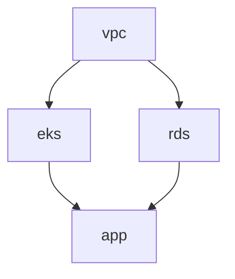

# What is TerraCi?

TerraCi is a CLI tool that analyzes Terraform/OpenTofu projects and automatically generates CI pipelines (GitLab CI and GitHub Actions) with proper dependency ordering.

## The Problem

When managing infrastructure as code in a monorepo with multiple Terraform modules, you face several challenges:

1. **Dependency Management** - Modules often depend on each other (e.g., EKS depends on VPC). Running them in the wrong order causes failures.

2. **Manual Pipeline Maintenance** - Writing and maintaining CI pipelines manually is error-prone and tedious.

3. **Change Detection** - When only one module changes, you don't want to re-apply all modules.

4. **Parallel Execution** - Independent modules should run in parallel to reduce deployment time.

## The Solution

TerraCi solves these problems by:

### 1. Automatic Module Discovery

TerraCi scans your directory structure to find all Terraform modules:

```
infrastructure/
├── platform/
│   ├── stage/
│   │   └── eu-central-1/
│   │       ├── vpc/        ← Module discovered
│   │       ├── eks/        ← Module discovered
│   │       └── rds/        ← Module discovered
```

### 2. Dependency Extraction

It parses `terraform_remote_state` data sources to understand which modules depend on which:

```hcl
# In eks/main.tf
data "terraform_remote_state" "vpc" {
  backend = "s3"
  config = {
    key = "platform/stage/eu-central-1/vpc/terraform.tfstate"
  }
}
```

TerraCi detects that `eks` depends on `vpc`.

### 3. Topological Sorting

Using Kahn's algorithm, TerraCi sorts modules into execution levels:



### 4. Pipeline Generation

Finally, it generates a CI pipeline (GitLab CI or GitHub Actions) where:
- Modules at the same level run in parallel
- Modules wait for their dependencies to complete
- Plan and apply stages are separated (optional)

## Key Features

| Feature | Description |
|---------|-------------|
| **Smart Discovery** | Finds modules at configurable depth (with submodules) |
| **Dependency Graph** | Builds accurate DAG from remote state references |
| **Cycle Detection** | Warns about circular dependencies |
| **Multi-Provider** | Full support for both GitLab CI and GitHub Actions |
| **Git Integration** | Detects changed modules from git diff |
| **Policy Checks** | OPA-based compliance enforcement on terraform plans |
| **Cost Estimation** | AWS cost estimates with monthly diffs in MR/PR comments |
| **OpenTofu Support** | Works with both Terraform and OpenTofu |
| **Interactive Init** | TUI wizard for guided project setup (`terraci init`) |
| **Configurable Patterns** | Flexible directory patterns with named segments |
| **Glob Filtering** | Include/exclude modules with patterns |
| **DOT Export** | Visualize dependencies with GraphViz |

## When to Use TerraCi

TerraCi is ideal for:

- **Monorepos** with multiple Terraform modules
- **Teams** that need consistent CI/CD pipelines
- **Complex infrastructures** with many interdependencies
- **GitLab CI** and **GitHub Actions** users

## Requirements

- Go 1.22+ (for building from source)
- GitLab CI or GitHub Actions (for pipeline execution)
- Terraform or OpenTofu modules using `terraform_remote_state`

## Next Steps

- [Getting Started](/guide/getting-started) — Install TerraCi and generate your first pipeline
- [How It Works](/guide/how-it-works) — Understand the architecture and data flow
