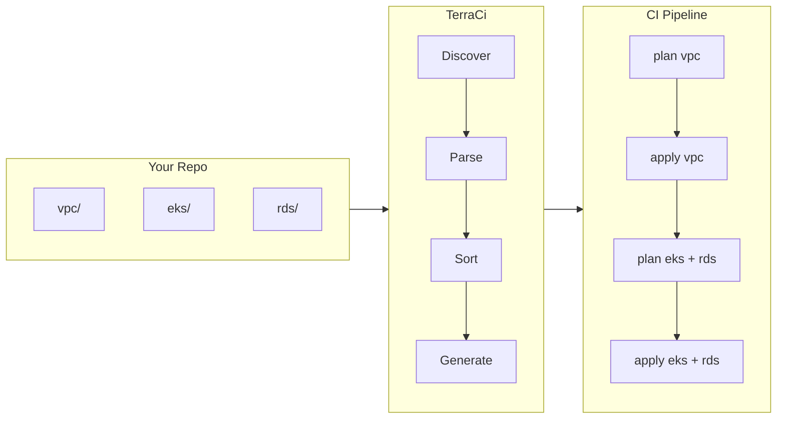

## Quick Start

```bash
# Install
brew install edelwud/tap/terraci

# Initialize & generate (GitLab)
terraci init
terraci generate -o .gitlab-ci.yml

# Initialize & generate (GitHub Actions)
terraci init --provider github
terraci generate -o .github/workflows/terraform.yml

# Only changed modules
terraci generate --changed-only --base-ref main
```

## How It Works



[Full configuration reference →](/config/)
