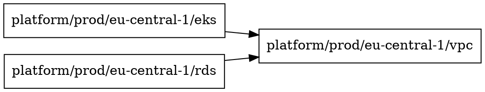

# terraci graph

Визуализация графа зависимостей модулей.

## Синтаксис

```bash
terraci graph [flags]
```

## Описание

Команда `graph` строит и отображает граф зависимостей между Terraform-модулями. Поддерживает несколько форматов вывода для анализа и визуализации.

## Флаги

| Флаг | Тип | По умолчанию | Описание |
|------|-----|--------------|----------|
| `--format` | string | `levels` | Формат вывода: `dot`, `json`, `levels`, `list` |
| `-o, --output` | string | stdout | Файл для записи |
| `--module` | string | | Фильтр по конкретному модулю |
| `--dependencies` | bool | false | Показать зависимости модуля |
| `--dependents` | bool | false | Показать зависимые модули |
| `--changed-only` | bool | false | Только изменённые модули |
| `--base-ref` | string | `main` | Базовая ветка для сравнения |

## Форматы вывода

### levels

Группировка модулей по уровням выполнения:

```bash
terraci graph --format levels
```

```
Level 0 (parallel):
  platform/prod/eu-central-1/vpc
  platform/prod/eu-west-1/vpc

Level 1:
  platform/prod/eu-central-1/eks
  platform/prod/eu-central-1/rds
  platform/prod/eu-west-1/eks

Level 2:
  platform/prod/eu-central-1/apps
```

### dot

Формат Graphviz DOT для визуализации:

```bash
terraci graph --format dot -o deps.dot
```



Визуализация:
```bash
dot -Tpng deps.dot -o deps.png
dot -Tsvg deps.dot -o deps.svg
```

### json

JSON-формат для программной обработки:

```bash
terraci graph --format json
```

```json
{
  "modules": [
    {
      "id": "platform/prod/eu-central-1/vpc",
      "service": "platform",
      "environment": "prod",
      "region": "eu-central-1",
      "module": "vpc",
      "dependencies": [],
      "dependents": ["eks", "rds"]
    },
    {
      "id": "platform/prod/eu-central-1/eks",
      "service": "platform",
      "environment": "prod",
      "region": "eu-central-1",
      "module": "eks",
      "dependencies": ["vpc"],
      "dependents": ["apps"]
    }
  ],
  "edges": [
    {
      "from": "platform/prod/eu-central-1/eks",
      "to": "platform/prod/eu-central-1/vpc"
    }
  ]
}
```

### list

Простой список модулей:

```bash
terraci graph --format list
```

```
platform/prod/eu-central-1/vpc
platform/prod/eu-central-1/eks
platform/prod/eu-central-1/rds
platform/prod/eu-west-1/vpc
platform/prod/eu-west-1/eks
```

## Фильтрация

### Конкретный модуль

```bash
# Показать модуль и связи
terraci graph --module platform/prod/eu-central-1/eks
```

### Зависимости модуля

Модули, от которых зависит указанный:

```bash
terraci graph --module platform/prod/eu-central-1/eks --dependencies
```

```
platform/prod/eu-central-1/eks depends on:
  platform/prod/eu-central-1/vpc
```

### Зависимые модули

Модули, которые зависят от указанного:

```bash
terraci graph --module platform/prod/eu-central-1/vpc --dependents
```

```
Modules depending on platform/prod/eu-central-1/vpc:
  platform/prod/eu-central-1/eks
  platform/prod/eu-central-1/rds
  platform/prod/eu-central-1/apps (transitive)
```

### Изменённые модули

```bash
terraci graph --changed-only --base-ref main --format levels
```

## Примеры использования

### Анализ зависимостей

```bash
# Общая картина
terraci graph --format levels

# Детальный граф
terraci graph --format dot -o graph.dot
dot -Tsvg graph.dot -o graph.svg
```

### Влияние изменений

```bash
# Что затронет изменение VPC?
terraci graph \
  --module platform/prod/eu-central-1/vpc \
  --dependents \
  --format list
```

### Отладка порядка выполнения

```bash
# Почему модуль на этом уровне?
terraci graph \
  --module platform/prod/eu-central-1/eks \
  --dependencies
```

### Экспорт для документации

```bash
# SVG для wiki
terraci graph --format dot | dot -Tsvg > architecture.svg

# Markdown-таблица
terraci graph --format json | jq -r '.modules[] | "| \(.id) | \(.dependencies | join(", ")) |"'
```

## Интеграция с инструментами

### Graphviz

```bash
# PNG
terraci graph --format dot | dot -Tpng > deps.png

# SVG (рекомендуется)
terraci graph --format dot | dot -Tsvg > deps.svg

# PDF
terraci graph --format dot | dot -Tpdf > deps.pdf
```

### jq

```bash
# Список модулей без зависимостей
terraci graph --format json | jq '.modules[] | select(.dependencies == []) | .id'

# Модули с максимальным количеством зависимых
terraci graph --format json | jq '.modules | sort_by(.dependents | length) | reverse | .[0:5]'
```

### CI/CD

```yaml
graph:
  stage: docs
  script:
    - terraci graph --format dot -o deps.dot
    - dot -Tsvg deps.dot -o deps.svg
  artifacts:
    paths:
      - deps.svg
```

## Диагностика

### Неожиданные зависимости

```bash
# Проверить конкретный модуль
terraci graph --module <id> --dependencies -v

# Посмотреть remote_state в коде
grep -r "terraform_remote_state" path/to/module/
```

### Слишком глубокий граф

```bash
# Посмотреть количество уровней
terraci graph --format levels | grep "Level" | wc -l

# Найти "бутылочное горлышко"
terraci graph --format json | jq '.modules | max_by(.dependents | length)'
```

## Советы

1. **SVG лучше PNG** — масштабируется без потерь
2. **`--dependents`** — показывает blast radius изменений
3. **JSON + jq** — мощный инструмент для анализа
4. **Регулярно обновляйте** визуализацию в документации
