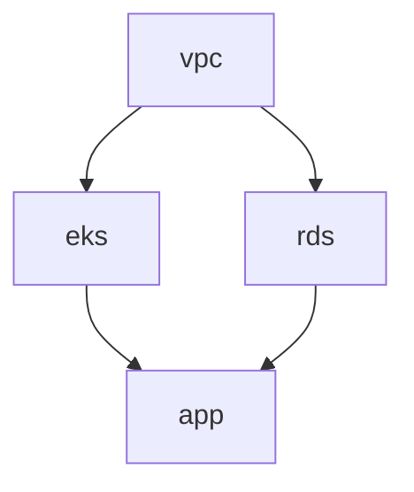
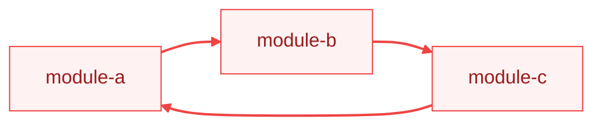

# Разрешение зависимостей

TerraCi автоматически обнаруживает зависимости между Terraform-модулями, анализируя data-источники `terraform_remote_state`.

## Как это работает

### 1. Парсинг remote state

TerraCi парсит все `.tf` файлы в каждом модуле, ища `terraform_remote_state`:

```hcl
data "terraform_remote_state" "vpc" {
  backend = "s3"
  config = {
    bucket = "my-terraform-state"
    key    = "platform/production/us-east-1/vpc/terraform.tfstate"
    region = "us-east-1"
  }
}
```

### 2. Извлечение путей

Из каждого блока remote state извлекается:
- **Тип бэкенда** (s3, gcs, azurerm и т.д.)
- **Путь к state-файлу** (из `key`, `prefix` или аналогичных полей)
- **Наличие `for_each`**

### 3. Сопоставление с модулями

Путь state-файла сопоставляется с обнаруженными модулями:

```
key: platform/production/us-east-1/vpc/terraform.tfstate
     ↓
Module ID: platform/production/us-east-1/vpc
```

### 4. Построение графа

Зависимости добавляются в направленный ациклический граф (DAG):



## Поддерживаемые бэкенды

| Бэкенд | Поле пути |
|--------|-----------|
| s3 | `key` |
| gcs | `prefix` |
| azurerm | `key` |
| http | `address` |
| consul | `path` |

## Динамические ссылки с `for_each`

TerraCi обрабатывает `for_each` в remote state:

```hcl
locals {
  dependencies = {
    vpc = "platform/production/us-east-1/vpc"
    iam = "platform/production/us-east-1/iam"
  }
}

data "terraform_remote_state" "deps" {
  for_each = local.dependencies

  backend = "s3"
  config = {
    bucket = "my-terraform-state"
    key    = "${each.value}/terraform.tfstate"
  }
}
```

Это создаёт зависимости от модулей `vpc` и `iam`.

## Разрешение локальных переменных

TerraCi разрешает ссылки на локальные переменные в путях:

```hcl
locals {
  env        = "production"
  region     = "us-east-1"
  state_key  = "platform/${local.env}/${local.region}/vpc/terraform.tfstate"
}

data "terraform_remote_state" "vpc" {
  backend = "s3"
  config = {
    key = local.state_key
  }
}
```

## Резервное сопоставление по имени

Если путь state-файла не удаётся сопоставить с модулем, TerraCi использует резервное сопоставление по имени:

```hcl
# Модуль: platform/production/us-east-1/eks

data "terraform_remote_state" "vpc" {  # ← имя "vpc"
  # ...
}
```

TerraCi ищет модуль с именем `vpc` в том же сервисе/окружении/регионе.

## Зависимости сабмодулей

Для сабмодулей TerraCi также использует сопоставление по паттерну:

```hcl
# В модуле: platform/production/us-east-1/ec2/rabbitmq

data "terraform_remote_state" "ec2_base" {
  # ...
}
```

Соответствия:
- `ec2_base` → `ec2/base` (паттерн сабмодуля)
- `ec2-base` → `ec2/base` (через дефис)

## Уровни выполнения

TerraCi группирует модули по уровням выполнения:

```
Уровень 0: [vpc, iam]           # Нет зависимостей
Уровень 1: [eks, rds]           # Зависят от уровня 0
Уровень 2: [app]                # Зависит от уровня 1
```

Модули одного уровня могут выполняться параллельно.

## Кросс-окружающие зависимости

TerraCi поддерживает зависимости, пересекающие границы окружений или регионов. Это полезно, когда модулю в одном окружении нужно ссылаться на ресурсы из другого:

```hcl
# В модуле: platform/stage/eu-central-1/ec2/db-migrate

# Зависимость в том же окружении/регионе
data "terraform_remote_state" "vpc" {
  backend = "s3"
  config = {
    key = "${local.service}/${local.environment}/${local.region}/vpc/terraform.tfstate"
  }
}

# Кросс-окружающая зависимость (захардкоженный путь)
data "terraform_remote_state" "vpn_vpc" {
  backend = "s3"
  config = {
    key = "${local.service}/vpn/eu-north-1/vpc/terraform.tfstate"
  }
}
```

Обе зависимости будут обнаружены:
- `platform/stage/eu-central-1/vpc` (из динамического пути)
- `platform/vpn/eu-north-1/vpc` (из захардкоженного кросс-окружающего пути)

TerraCi резолвит переменные `local.*` из структуры пути модуля, позволяя смешивать динамические и захардкоженные пути в одном модуле.

Смотрите [пример cross-env-deps](https://github.com/edelwud/terraci/tree/main/examples/cross-env-deps) для полного рабочего примера.

## Детекция циклов

TerraCi обнаруживает циклические зависимости:

```bash
terraci validate
```

Вывод:
```
✗ Circular dependency detected:
  module-a → module-b → module-c → module-a
```



Циклические зависимости блокируют генерацию пайплайна.

## Визуализация

Экспортируйте граф зависимостей:

```bash
# DOT формат для GraphViz
terraci graph --format dot -o deps.dot
dot -Tpng deps.dot -o deps.png

# Текстовый список
terraci graph --format list

# Уровни выполнения
terraci graph --format levels
```

## Устранение неполадок

### Зависимость не обнаружена

1. Убедитесь, что путь state-файла совпадает с ID модуля:
   ```bash
   terraci validate -v
   ```

2. Проверьте паттерн пути:
   ```yaml
   backend:
     key_pattern: "{service}/{environment}/{region}/{module}/terraform.tfstate"
   ```

3. Проверьте наличие опечаток в конфигурации remote state

### Слишком много зависимостей

Если обнаружены непредусмотренные зависимости:

1. Проверьте значения `key` в remote state
2. Убедитесь, что пути state-файлов соответствуют ожидаемому паттерну
3. Проверьте, нет ли ссылок на общие state-файлы

### Модуль не найден

Если указанный в ссылке модуль не обнаруживается:

1. Убедитесь, что модуль существует на правильной глубине
2. Проверьте, что он содержит `.tf` файлы
3. Убедитесь, что он не исключён паттернами фильтрации

## Следующие шаги

- [Генерация пайплайнов](/ru/guide/pipeline-generation) — структура пайплайна и параллельное выполнение
- [Визуализация графа](/ru/cli/graph) — экспорт и визуализация графа зависимостей
