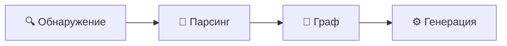
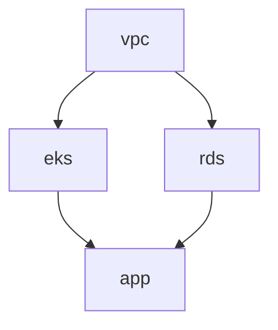
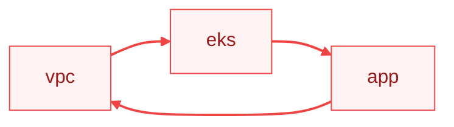
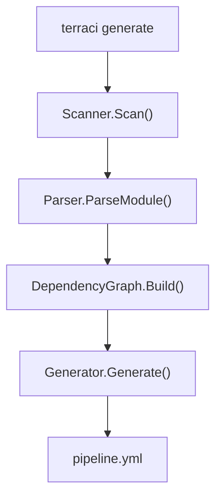

# Как это работает

Это руководство объясняет внутреннюю архитектуру и поток данных TerraCi.

## Обзор

TerraCi обрабатывает ваш Terraform проект в четыре этапа:



## Этап 1: Обнаружение модулей

TerraCi сканирует структуру директорий для поиска Terraform модулей.

### Как это работает

1. Обход дерева директорий от корня проекта
2. Поиск директорий на глубине 4-5 содержащих `.tf` файлы
3. Парсинг пути для извлечения service, environment, region, module

### Пример

```
platform/stage/eu-central-1/vpc/main.tf
   │       │         │       │
   │       │         │       └── module: vpc
   │       │         └── region: eu-central-1
   │       └── environment: stage
   └── service: platform
```

### ID модуля

Каждый модуль получает уникальный ID: `platform/stage/eu-central-1/vpc`

Этот ID используется для:
- Сопоставления зависимостей
- Именования джобов
- Разрешения пути к state-файлу

## Этап 2: Парсинг HCL

TerraCi парсит `.tf` файлы каждого модуля для извлечения зависимостей.

### Что парсится

1. **Блоки `terraform_remote_state`** - основной источник зависимостей
2. **Блоки `locals`** - разрешение переменных для динамических путей

### Пример Remote State

```hcl
data "terraform_remote_state" "vpc" {
  backend = "s3"
  config = {
    bucket = "my-state"
    key    = "platform/stage/eu-central-1/vpc/terraform.tfstate"
  }
}
```

TerraCi извлекает:
- Тип backend: `s3`
- Путь к state: `platform/stage/eu-central-1/vpc/terraform.tfstate`
- Разрешённый модуль: `platform/stage/eu-central-1/vpc`

### Разрешение путей

TerraCi разрешает переменные в путях state:

```hcl
locals {
  env = "stage"
}

data "terraform_remote_state" "vpc" {
  config = {
    key = "platform/${local.env}/eu-central-1/vpc/terraform.tfstate"
  }
}
```

Становится: `platform/stage/eu-central-1/vpc/terraform.tfstate`

### Обработка for_each

При наличии `for_each` TerraCi раскрывает в несколько зависимостей:

```hcl
data "terraform_remote_state" "services" {
  for_each = toset(["auth", "api", "web"])
  config = {
    key = "platform/stage/eu-central-1/${each.key}/terraform.tfstate"
  }
}
```

Создаёт зависимости от модулей: `auth`, `api`, `web`.

## Этап 3: Построение графа

TerraCi строит направленный ациклический граф (DAG) зависимостей модулей.

### Алгоритм

1. Создание узла для каждого обнаруженного модуля
2. Добавление рёбер от каждого модуля к его зависимостям
3. Обнаружение циклов (ошибка если найдены)
4. Топологическая сортировка алгоритмом Кана

### Топологическая сортировка

Алгоритм Кана гарантирует порядок где зависимости идут первыми:



### Уровни выполнения

Модули группируются по уровням для параллельного выполнения:

| Уровень | Модули | Параллельно |
|---------|--------|-------------|
| 0 | vpc | Да (нет зависимостей) |
| 1 | eks, rds | Да (одинаковые зависимости) |
| 2 | app | После уровня 1 |

### Обнаружение циклов

TerraCi обнаруживает циклические зависимости:



Сообщение об ошибке:
```
Error: circular dependency detected
  vpc -> eks -> app -> vpc
```

## Этап 4: Генерация пайплайна

TerraCi генерирует GitLab CI YAML из отсортированного графа модулей.

### Генерация джобов

Для каждого модуля TerraCi генерирует:

1. **Plan джоб** (если `plan_enabled: true`)
   - Выполняет `terraform plan -out=plan.tfplan`
   - Сохраняет план как артефакт

2. **Apply джоб**
   - Зависит от plan джоба (`needs`)
   - Выполняет `terraform apply plan.tfplan`
   - Ручной запуск (если `auto_approve: false`)

### Маппинг стейджей

Уровни выполнения отображаются на GitLab стейджи:

```yaml
stages:
  - deploy-plan-0   # Планы уровня 0
  - deploy-apply-0  # Применение уровня 0
  - deploy-plan-1   # Планы уровня 1
  - deploy-apply-1  # Применение уровня 1
```

### Цепочка зависимостей

```yaml
plan-vpc:
  stage: deploy-plan-0

apply-vpc:
  stage: deploy-apply-0
  needs: [plan-vpc]

plan-eks:
  stage: deploy-plan-1
  needs: [apply-vpc]  # Ждёт применения vpc

apply-eks:
  stage: deploy-apply-1
  needs: [plan-eks]
```

## Диаграмма потока данных



Описание каждого этапа:

| Шаг | Функция | Что делает |
|-----|---------|-----------|
| 1 | `Scanner.Scan()` | Обход дерева директорий, поиск `.tf` файлов на глубине 4-5, создание Module |
| 2 | `Parser.ParseModule()` | Парсинг HCL, извлечение locals, поиск `terraform_remote_state`, разрешение переменных |
| 3 | `DependencyGraph.Build()` | Добавление узлов/рёбер, детекция циклов, топологическая сортировка → уровни |
| 4 | `Generator.Generate()` | Создание стадий, генерация plan/apply джобов, применение overwrites, вывод YAML |

## Ключевые типы

### Module

Представляет обнаруженный Terraform модуль:

```go
type Module struct {
    Service      string  // platform
    Environment  string  // stage
    Region       string  // eu-central-1
    Module       string  // vpc
    Path         string  // /abs/path/to/vpc
    RelativePath string  // platform/stage/eu-central-1/vpc
}

func (m *Module) ID() string  // "platform/stage/eu-central-1/vpc"
```

### RemoteStateRef

Представляет зависимость `terraform_remote_state`:

```go
type RemoteStateRef struct {
    Name         string            // "vpc"
    Backend      string            // "s3"
    Config       map[string]string // bucket, key, region
    WorkspaceDir string            // разрешённый путь модуля
}
```

### DependencyGraph

Управляет связями между модулями:

```go
type DependencyGraph struct {
    nodes map[string]*Module
    edges map[string][]string  // from -> [to, to, ...]
}

func (g *DependencyGraph) AddEdge(from, to *Module)
func (g *DependencyGraph) TopologicalSort() ([]*Module, error)
func (g *DependencyGraph) ExecutionLevels() [][]*Module
func (g *DependencyGraph) DetectCycles() [][]string
```

## Производительность

TerraCi оптимизирован для скорости:

| Размер проекта | Модулей | Время парсинга | Время генерации |
|----------------|---------|----------------|-----------------|
| Маленький | 10 | ~100мс | ~50мс |
| Средний | 50 | ~300мс | ~100мс |
| Большой | 200 | ~1с | ~300мс |

Советы для больших проектов:
- Используйте паттерны `exclude` для пропуска ненужных директорий
- Используйте `--changed-only` для инкрементальных пайплайнов
- Включите кэширование в сгенерированных пайплайнах

## Смотрите также

- [Структура проекта](/ru/guide/project-structure) — требования к структуре директорий
- [Зависимости](/ru/guide/dependencies) — детали обнаружения зависимостей
- [Генерация пайплайнов](/ru/guide/pipeline-generation) — формат сгенерированного вывода
