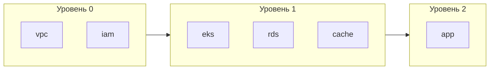

# Генерация пайплайнов

TerraCi генерирует GitLab CI пайплайны с учётом зависимостей модулей и параллельным выполнением.

## Базовая генерация

```bash
terraci generate -o .gitlab-ci.yml
```

## Структура пайплайна

### Стадии

Стадии создаются для каждого уровня выполнения:

```yaml
stages:
  - deploy-plan-0    # Plan для модулей уровня 0
  - deploy-apply-0   # Apply для модулей уровня 0
  - deploy-plan-1    # Plan для модулей уровня 1
  - deploy-apply-1   # Apply для модулей уровня 1
```

### Переменные

Глобальные переменные из конфигурации:

```yaml
variables:
  TERRAFORM_BINARY: "terraform"
  TF_IN_AUTOMATION: "true"
  TF_INPUT: "false"
```

### Конфигурация по умолчанию

Общие настройки джобов:

```yaml
default:
  image: hashicorp/terraform:1.6
  before_script:
    - ${TERRAFORM_BINARY} init
  tags:
    - terraform
    - docker
```

### Джобы

Два джоба на модуль (если `plan_enabled: true`):

```yaml
plan-platform-prod-us-east-1-vpc:
  stage: deploy-plan-0
  script:
    - cd platform/prod/us-east-1/vpc
    - ${TERRAFORM_BINARY} plan -out=plan.tfplan
  variables:
    TF_MODULE_PATH: platform/prod/us-east-1/vpc
    TF_SERVICE: platform
    TF_ENVIRONMENT: prod
    TF_REGION: us-east-1
    TF_MODULE: vpc
  artifacts:
    paths:
      - platform/prod/us-east-1/vpc/plan.tfplan
    expire_in: 1 day
  resource_group: platform/prod/us-east-1/vpc

apply-platform-prod-us-east-1-vpc:
  stage: deploy-apply-0
  script:
    - cd platform/prod/us-east-1/vpc
    - ${TERRAFORM_BINARY} apply plan.tfplan
  needs:
    - job: plan-platform-prod-us-east-1-vpc
  when: manual
  resource_group: platform/prod/us-east-1/vpc
```

## Зависимости джобов

Джобы используют `needs` для выражения зависимостей:

```yaml
plan-platform-prod-us-east-1-eks:
  stage: deploy-plan-1
  needs:
    - job: apply-platform-prod-us-east-1-vpc  # Ждёт VPC
  # ...

apply-platform-prod-us-east-1-eks:
  stage: deploy-apply-1
  needs:
    - job: plan-platform-prod-us-east-1-eks   # Ждёт собственный plan
    - job: apply-platform-prod-us-east-1-vpc  # Ждёт VPC
  # ...
```

## Параллельное выполнение

Независимые модули одного уровня выполняются параллельно:



## Пайплайны только для изменений

Генерация для изменённых модулей и связанных с ними:

```bash
terraci generate --changed-only --base-ref main -o .gitlab-ci.yml
```

Алгоритм:
1. Определяет файлы, изменённые с ветки `main`
2. Сопоставляет изменённые файлы с модулями
3. Находит все модули, зависящие от изменённых (dependents)
4. Находит все модули, от которых зависят изменённые (dependencies)
5. Генерирует пайплайн только для затронутых модулей

### Пример: изменение корневого модуля

Если изменился `vpc/main.tf`:
- `vpc` включён (изменён)
- `eks` включён (зависит от vpc)
- `rds` включён (зависит от vpc)
- `app` включён (зависит от eks и rds)

### Пример: изменение листового модуля

Если изменился `eks/main.tf`:
- `eks` включён (изменён)
- `vpc` включён (eks зависит от vpc)
- `app` включён (зависит от eks)

Это обеспечивает правильный порядок выполнения — зависимости деплоятся до изменённого модуля, а зависимые — после.

## Группы ресурсов

Каждый модуль использует `resource_group` для предотвращения одновременных apply:

```yaml
apply-platform-prod-us-east-1-vpc:
  resource_group: platform/prod/us-east-1/vpc
```

Это гарантирует, что для каждого модуля одновременно выполняется только один apply-джоб.

## Опции конфигурации

### Стадия plan

Включение или отключение стадии plan:

```yaml
gitlab:
  plan_enabled: true   # Генерировать plan джобы
  # plan_enabled: false  # Сразу к apply
```

### Auto-approve

Пропуск ручного подтверждения для apply-джобов:

```yaml
gitlab:
  auto_approve: false  # Требовать ручной запуск (по умолчанию)
  # auto_approve: true   # Автоматический apply
```

Можно переопределить через CLI:

```bash
# Включить auto-approve (пропустить ручной запуск)
terraci generate --auto-approve -o .gitlab-ci.yml

# Отключить auto-approve (требовать ручной запуск)
terraci generate --no-auto-approve -o .gitlab-ci.yml
```

Флаги CLI имеют приоритет над конфигурационным файлом.

### Префикс стадий

Настройка имён стадий:

```yaml
gitlab:
  stages_prefix: "terraform"  # terraform-plan-0, terraform-apply-0
```

### Пользовательские скрипты

Добавьте скрипты до и после выполнения через `job_defaults`:

```yaml
gitlab:
  job_defaults:
    before_script:
      - ${TERRAFORM_BINARY} init
      - ${TERRAFORM_BINARY} workspace select ${TF_ENVIRONMENT} || ${TERRAFORM_BINARY} workspace new ${TF_ENVIRONMENT}
    after_script:
      - ${TERRAFORM_BINARY} output -json > outputs.json
```

### Теги раннеров

Укажите теги GitLab-раннеров через `job_defaults`:

```yaml
gitlab:
  job_defaults:
    tags:
      - terraform
      - docker
      - aws
```

## Dry Run

Предпросмотр без генерации:

```bash
terraci generate --dry-run
```

Вывод:
```
Dry Run Summary:
  Total modules: 12
  Affected modules: 5
  Stages: 6
  Jobs: 10

Execution Order:
  Level 0: [vpc]
  Level 1: [eks, rds]
  Level 2: [app-backend, app-frontend]
```

## Форматы вывода

### Вывод в файл

```bash
terraci generate -o .gitlab-ci.yml
```

### Вывод в stdout

```bash
terraci generate  # Печатает в stdout
```

### Передача другим инструментам

```bash
terraci generate | yq '.stages'  # Извлечь стадии
```

## Следующие шаги

- [Git интеграция](/ru/guide/git-integration) — режим changed-only для инкрементальных деплоев
- [Настройка GitLab CI](/ru/config/gitlab) — все опции конфигурации пайплайна
