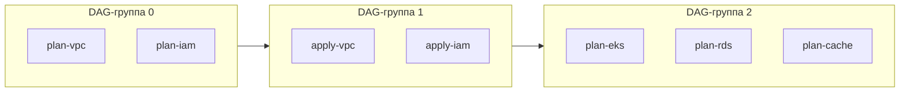

# Генерация пайплайнов

TerraCi генерирует CI пайплайны с учётом зависимостей модулей и параллельным выполнением. Поддерживаются как GitLab CI, так и GitHub Actions.

## Базовая генерация

Сгенерируйте пайплайн для всех модулей:

```bash
# GitLab CI
terraci generate -o .gitlab-ci.yml

# GitHub Actions
terraci generate -o .github/workflows/terraform.yml
```

Провайдер выбирается через `TERRACI_PROVIDER`, автоматически определяется из окружения (переменная `GITLAB_CI` выбирает GitLab, `GITHUB_ACTIONS` выбирает GitHub Actions) или выводится из единственного активного провайдера.

## Структура GitLab CI пайплайна

### Стадии

GitLab-стадии строятся из топологических DAG-слоёв:

```yaml
stages:
  - deploy-0
  - deploy-1
  - deploy-2
  - deploy-3
```

### Переменные

Глобальные переменные из конфигурации:

```yaml
variables:
  TF_IN_AUTOMATION: "true"
  TF_INPUT: "false"
```

### Конфигурация по умолчанию

Общие настройки джобов:

```yaml
default:
  image: hashicorp/terraform:1.6
  before_script:
    - terraform init
  tags:
    - terraform
    - docker
```

### Джобы


```yaml
plan-platform-prod-us-east-1-vpc:
  stage: deploy-0
  script:
    - cd platform/prod/us-east-1/vpc
    - terraform plan -out=plan.tfplan
  variables:
    TF_MODULE_PATH: platform/prod/us-east-1/vpc
    TF_SERVICE: platform
    TF_ENVIRONMENT: prod
    TF_REGION: us-east-1
    TF_MODULE: vpc
  artifacts:
    paths:
      - platform/prod/us-east-1/vpc/plan.tfplan
    expire_in: 1 day
  resource_group: platform/prod/us-east-1/vpc

apply-platform-prod-us-east-1-vpc:
  stage: deploy-1
  script:
    - cd platform/prod/us-east-1/vpc
    - terraform apply plan.tfplan
  needs:
    - job: plan-platform-prod-us-east-1-vpc
  when: manual
  resource_group: platform/prod/us-east-1/vpc
```

::: tip Динамические переменные окружения
Переменные `TF_SERVICE`, `TF_ENVIRONMENT`, `TF_REGION`, `TF_MODULE` генерируются динамически из сегментов настроенного паттерна. Если ваш паттерн `{team}/{env}/{module}`, то переменные будут `TF_TEAM`, `TF_ENV` и `TF_MODULE`.
:::

## Зависимости джобов

Джобы используют `needs` для выражения зависимостей:

```yaml
plan-platform-prod-us-east-1-eks:
  stage: deploy-2
  needs:
    - job: apply-platform-prod-us-east-1-vpc  # Ждёт VPC
  # ...

apply-platform-prod-us-east-1-eks:
  stage: deploy-3
  needs:
    - job: plan-platform-prod-us-east-1-eks   # Ждёт собственный plan
    - job: apply-platform-prod-us-east-1-vpc  # Ждёт VPC
  # ...
```

## Параллельное выполнение

Независимые DAG-джобы в одной топологической группе могут выполняться параллельно:



## Структура GitHub Actions workflow

При использовании провайдера GitHub Actions TerraCi генерирует workflow-файл с джобами, связанными DAG-зависимостями:

```yaml
name: Terraform
on:
  pull_request:
  workflow_dispatch:

jobs:
  plan-platform-prod-us-east-1-vpc:
    runs-on: ubuntu-latest
    steps:
      - uses: actions/checkout@v4
      - name: Plan
        run: |
          cd platform/prod/us-east-1/vpc
          terraform plan -out=plan.tfplan
      - uses: actions/upload-artifact@v4
        with:
          name: plan-platform-prod-us-east-1-vpc
          path: platform/prod/us-east-1/vpc/plan.tfplan

  apply-platform-prod-us-east-1-vpc:
    needs: [plan-platform-prod-us-east-1-vpc]
    runs-on: ubuntu-latest
    environment: production
    steps:
      - uses: actions/checkout@v4
      - uses: actions/download-artifact@v4
        with:
          name: plan-platform-prod-us-east-1-vpc
      - name: Apply
        run: |
          cd platform/prod/us-east-1/vpc
          terraform apply plan.tfplan
```

GitHub Actions джобы используют `needs` для порядка зависимостей, `actions/upload-artifact` и `actions/download-artifact` для передачи plan-файлов между джобами, и `environment` для шлюзов одобрения.

## Пайплайны только для изменений

Генерация для изменённых модулей и связанных с ними:

```bash
terraci generate --changed-only --base-ref main -o .gitlab-ci.yml
```

Алгоритм:
1. Определяет файлы, изменённые с ветки `main`
2. Сопоставляет изменённые файлы с модулями
3. Находит все модули, зависящие от изменённых (dependents)
4. Находит все модули, от которых зависят изменённые (dependencies)
5. Генерирует пайплайн только для затронутых модулей

### Пример: изменение корневого модуля

Если изменился `vpc/main.tf`:
- `vpc` включён (изменён)
- `eks` включён (зависит от vpc)
- `rds` включён (зависит от vpc)
- `app` включён (зависит от eks и rds)

### Пример: изменение листового модуля

Если изменился `eks/main.tf`:
- `eks` включён (изменён)
- `vpc` включён (eks зависит от vpc)
- `app` включён (зависит от eks)

Это обеспечивает правильный порядок выполнения — зависимости деплоятся до изменённого модуля, а зависимые — после.

## Группы ресурсов

Каждый модуль использует `resource_group` для предотвращения одновременных apply:

```yaml
apply-platform-prod-us-east-1-vpc:
  resource_group: platform/prod/us-east-1/vpc
```

Это гарантирует, что для каждого модуля одновременно выполняется только один apply-джоб.

## Опции конфигурации

### Стадия plan

Включение или отключение plan-джобов глобально через верхнеуровневую секцию `execution:` (применяется к обоим провайдерам):

```yaml
execution:

extensions:
  gitlab:
```

### Запуск apply

Поведение apply-джобов настраивается через provider overwrites. Например,
сделать GitLab apply ручным:

```yaml
extensions:
  gitlab:
    overwrites:
      - type: apply
        when: manual
```

### Префикс стадий

Настройка имён стадий:

```yaml
extensions:
  gitlab:
    stages_prefix: "terraform"  # terraform-0, terraform-1
```

### Пользовательские скрипты

Добавьте скрипты до и после выполнения через `job_defaults`:

```yaml
extensions:
  gitlab:
    job_defaults:
      before_script:
        - terraform init
        - terraform workspace select ${TF_ENVIRONMENT} || terraform workspace new ${TF_ENVIRONMENT}
      after_script:
        - terraform output -json > outputs.json
```

### Теги раннеров

Укажите теги GitLab-раннеров через `job_defaults`:

```yaml
extensions:
  gitlab:
    job_defaults:
      tags:
        - terraform
        - docker
        - aws
```

## Dry Run

Предпросмотр без генерации:

```bash
terraci generate --dry-run
```

Вывод:
```
Dry Run Summary:
  Total modules: 12
  Affected modules: 5
  Stages: 6
  Jobs: 10

Job Groups:
  dag-level-0: [plan-vpc]
  dag-level-1: [apply-vpc]
  dag-level-2: [plan-eks plan-rds]
```

## Форматы вывода

### Вывод в файл

```bash
terraci generate -o .gitlab-ci.yml
```

### Вывод в stdout

```bash
terraci generate  # Печатает в stdout
```

### Передача другим инструментам

```bash
terraci generate | yq '.stages'  # Извлечь стадии
```

## Следующие шаги

- [Git интеграция](/ru/guide/git-integration) — режим changed-only для инкрементальных деплоев
- [Настройка GitLab CI](/ru/config/gitlab) — все опции конфигурации пайплайна
