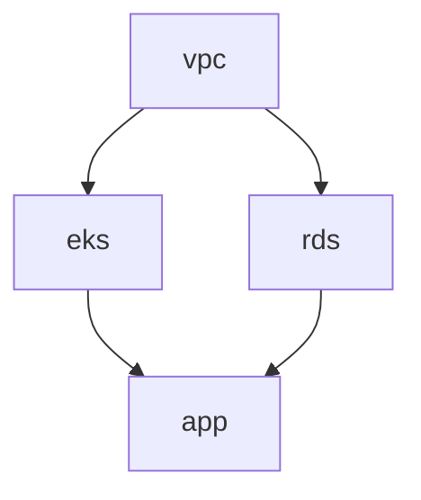

# Что такое TerraCi?

TerraCi — это CLI-инструмент, который анализирует Terraform/OpenTofu проекты и автоматически генерирует CI пайплайны (GitLab CI и GitHub Actions) с правильным порядком выполнения модулей.

## Проблема

При управлении инфраструктурой в монорепозитории с множеством Terraform-модулей возникают следующие проблемы:

1. **Управление зависимостями** — модули часто зависят друг от друга (например, EKS зависит от VPC). Выполнение в неправильном порядке приводит к ошибкам.

2. **Ручное обслуживание пайплайнов** — написание и поддержка CI пайплайнов вручную трудоёмко и подвержено ошибкам.

3. **Определение изменений** — когда меняется только один модуль, не нужно пересобирать все модули.

4. **Параллельное выполнение** — независимые модули должны выполняться параллельно для сокращения времени деплоя.

## Решение

TerraCi решает эти проблемы следующим образом:

### 1. Автоматическое обнаружение модулей

TerraCi сканирует структуру директорий для поиска всех Terraform-модулей:

```
infrastructure/
├── platform/
│   ├── stage/
│   │   └── eu-central-1/
│   │       ├── vpc/        ← Модуль найден
│   │       ├── eks/        ← Модуль найден
│   │       └── rds/        ← Модуль найден
```

### 2. Извлечение зависимостей

Парсит data-источники `terraform_remote_state` для определения зависимостей:

```hcl
# В eks/main.tf
data "terraform_remote_state" "vpc" {
  backend = "s3"
  config = {
    key = "platform/stage/eu-central-1/vpc/terraform.tfstate"
  }
}
```

TerraCi определяет, что `eks` зависит от `vpc`.

### 3. Топологическая сортировка

Используя алгоритм Кана, TerraCi сортирует модули по уровням выполнения:



### 4. Генерация пайплайна

Генерирует CI пайплайн (GitLab CI или GitHub Actions), где:
- Модули одного уровня выполняются параллельно
- Модули ждут завершения своих зависимостей
- Plan и apply стадии разделены (опционально)

## Ключевые возможности

| Возможность | Описание |
|-------------|----------|
| **Умное обнаружение** | Находит модули на настраиваемой глубине (с сабмодулями) |
| **Граф зависимостей** | Строит точный DAG из remote state ссылок |
| **Детекция циклов** | Предупреждает о циклических зависимостях |
| **Мульти-провайдер** | Полная поддержка GitLab CI и GitHub Actions |
| **Git интеграция** | Определяет изменённые модули через git diff |
| **Проверка политик** | OPA-политики для контроля соответствия terraform планов |
| **Оценка стоимости** | Оценка стоимости AWS с разницей в MR/PR-комментариях |
| **Поддержка OpenTofu** | Работает с Terraform и OpenTofu |
| **Интерактивная инициализация** | TUI-мастер для настройки проекта (`terraci init`) |
| **Настраиваемые паттерны** | Гибкие паттерны директорий с именованными сегментами |
| **Glob-фильтрация** | Include/exclude модулей по паттернам |
| **DOT экспорт** | Визуализация зависимостей в GraphViz |

## Когда использовать TerraCi

TerraCi идеален для:

- **Монорепозиториев** с множеством Terraform-модулей
- **Команд**, которым нужны консистентные CI/CD пайплайны
- **Сложной инфраструктуры** со множеством взаимозависимостей
- **Пользователей GitLab CI** и **GitHub Actions**

## Требования

- Go 1.22+ (для сборки из исходников)
- GitLab CI или GitHub Actions (для выполнения пайплайнов)
- Terraform или OpenTofu модули с использованием `terraform_remote_state`

## Следующие шаги

- [Быстрый старт](/ru/guide/getting-started) — установка и генерация первого пайплайна
- [Как это работает](/ru/guide/how-it-works) — архитектура и поток данных TerraCi
