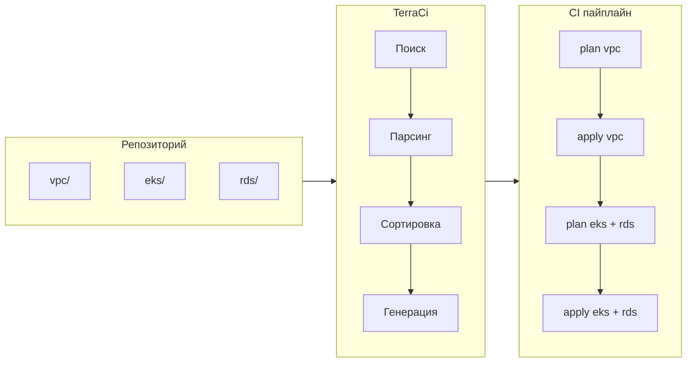

## Быстрый старт

```bash
# Установка
brew install edelwud/tap/terraci

# Инициализация и генерация (GitLab)
terraci init
terraci generate -o .gitlab-ci.yml

# Инициализация и генерация (GitHub Actions)
terraci init --provider github
terraci generate -o .github/workflows/terraform.yml

# Только изменённые модули
terraci generate --changed-only --base-ref main
```

## Как это работает



[Полный справочник конфигурации →](/ru/config/)
